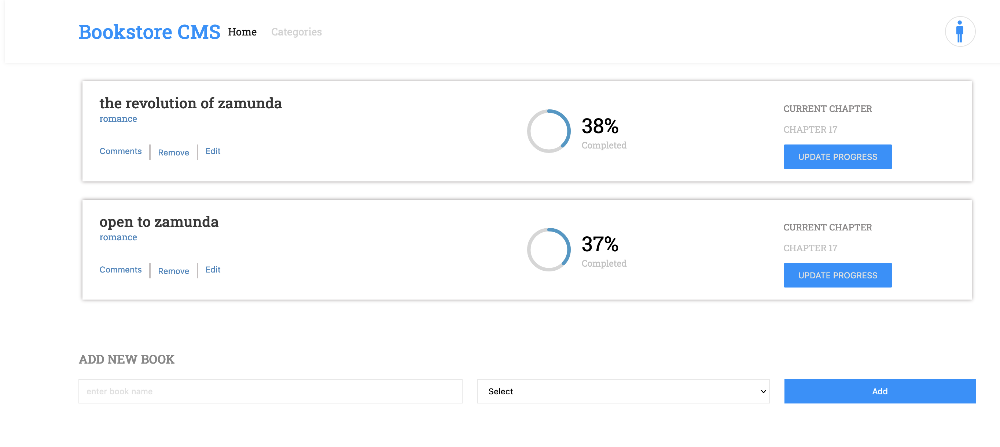

# LEADBOARD APP
> This project will lay foundations for your Bookstore website. You will create a React and Redux app. You will structure your files using the "feature folder" approach. You will also set up routing using React Router.

## Live Preview
> [Web App Link](https://aime-book-store.netlify.app/)
## Built With
- HTML & CSS & JavaScript
- Html, Css & JavaScript linters
- React.Js and Redux

##### Getting Started
- clone the repository by running\
    `git clone https://github.com/aimemalaika/book-store.git`
- navigate to the folder\
    `cd book-store`
- Install packages\
    `npm install`
- Run the app\
    `npm start`
- Eject the app\
    `npm run eject`
- Create build app\
    `npm run build`
- Test Linters app\
    `npm run check-linters`
## Authors 

👤 **Aime Malaika**
- GitHub: [@aimemalaika](https://github.com/aimemalaika)
- Twitter: [@aimemalaika](https://twitter.com/Aime_Malaika)
- LinkedIn: [@aimemalaika](https://linkedin.com/in/aimemalaika)

## :handshake: Contributing
Contributions, issues, and feature requests are welcome!
## Show your support
Give a :star:️ if you like this project!
## :memo: License
This project is [MIT](./MIT.md) licensed.